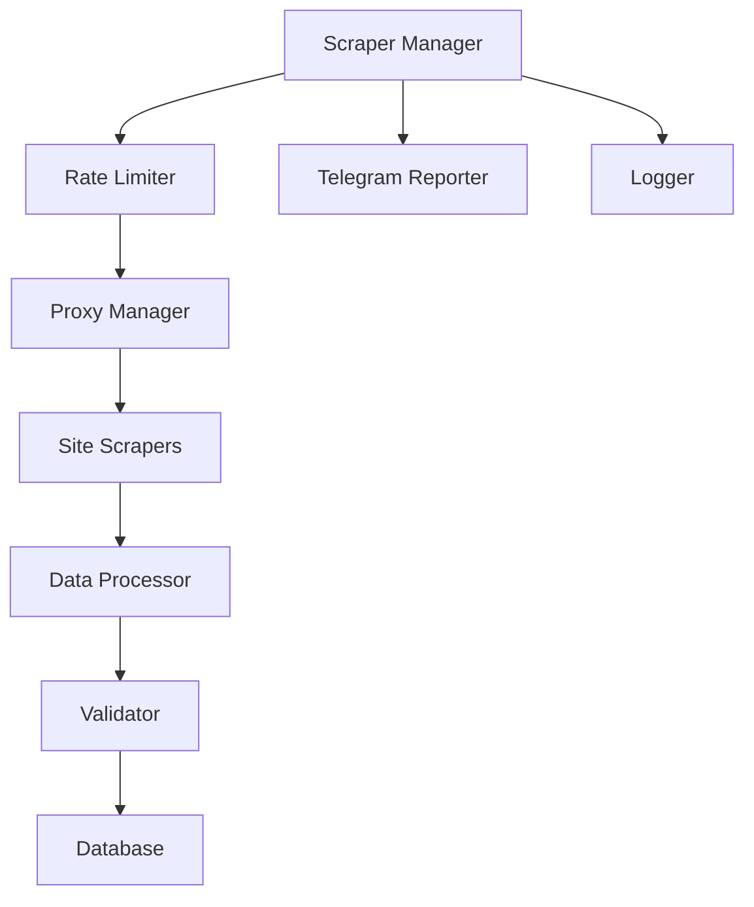

# 🏢 Azerbaijan Real Estate Data Scraper

An enterprise-grade, asynchronous web scraping system for collecting and analyzing real estate listings from major Azerbaijani property websites. Built with modern Python async capabilities and designed for reliability, scalability, and maintainability.

[](https://choosealicense.com/licenses/mit/)
[](https://www.python.org/downloads/)
[](https://github.com/psf/black)
[](https://github.com/Ismat-Samadov/real_estate/graphs/commit-activity)

## 📋 Table of Contents

- [Overview](#-overview)
- [Features](#-features)
- [System Architecture](#-system-architecture)
- [Supported Websites](#-supported-websites)
- [Installation](#-installation)
- [Configuration](#-configuration)
- [Usage](#-usage)
- [Deployment](#-deployment)
- [Monitoring](#-monitoring)
- [Contributing](#-contributing)
- [License](#-license)

## 🎯 Overview

This system autonomously collects comprehensive real estate data from Azerbaijan's leading property websites, providing a unified dataset for analysis and insights. The scraper handles various property types, including:

- 🏢 Apartments and Flats
- 🏘️ Houses and Villas
- 🏬 Commercial Properties
- 🏗️ New Developments
- 🏡 Rental Properties

### Collected Data Points

| Category | Data Points |
|----------|------------|
| Basic Info | Price, Rooms, Floor, Area, Property Type |
| Location | Address, District, Metro Station, GPS Coordinates |
| Features | Renovation Status, Amenities, Building Type |
| Media | Photos, Descriptions, Virtual Tours |
| Contact | Phone Numbers, Agent/Owner Status |
| Metadata | Listing Date, View Count, Update History |

## 🚀 Features

### Core Capabilities

- **High Performance**
  - Asynchronous multi-site scraping
  - Connection pooling
  - Efficient resource utilization
  - Smart rate limiting

- **Reliability**
  - Automatic retry mechanisms
  - Error recovery
  - Data validation
  - Transaction management

- **Monitoring**
  - Real-time Telegram notifications
  - Detailed logging
  - Performance metrics
  - Error tracking

### Technical Features

- **Data Collection**
  - Proxy rotation system
  - Anti-bot detection measures
  - Session management
  - Concurrent processing

- **Data Processing**
  - Advanced text extraction
  - Image URL processing
  - Location normalization
  - Price standardization

- **Storage**
  - MySQL optimization
  - Data deduplication
  - Schema validation
  - Backup system

## 🏗 System Architecture



## 🌐 Supported Websites

| Website | Status | Features | Update Frequency |
|---------|--------|-----------|-----------------|
| [bina.az](https://bina.az) | ✅ | Full data, Photos, Contact | 2h |
| [yeniemlak.az](https://yeniemlak.az) | ✅ | Full data, Location | 2h |
| [emlak.az](https://emlak.az) | ✅ | Full data, Contact | 2h |
| [lalafo.az](https://lalafo.az) | ✅ | API integration | 2h |
| [tap.az](https://tap.az) | ✅ | Full data, Photos | 2h |
| [ev10.az](https://ev10.az) | ✅ | Full data | 2h |
| [arenda.az](https://arenda.az) | ✅ | Full data, Location | 2h |
| [ipoteka.az](https://ipoteka.az) | ✅ | Full data, Mortgage | 2h |
| [unvan.az](https://unvan.az) | ✅ | Full data | 2h |
| [vipemlak.az](https://vipemlak.az) | ✅ | Full data | 2h |

## 🛠 Installation

### Prerequisites

- Python 3.10+
- MySQL 8.0+
- Git
- Virtual Environment

### Step-by-Step Setup

1. **Clone Repository**
   ```bash
   git clone https://github.com/Ismat-Samadov/real_estate.git
   cd real_estate
   ```

2. **Create Virtual Environment**
   ```bash
   python -m venv .venv
   
   # Linux/macOS
   source .venv/bin/activate
   
   # Windows
   .venv\Scripts\activate
   ```

3. **Install Dependencies**
   ```bash
   pip install --upgrade pip
   pip install -r requirements.txt
   ```

4. **Database Setup**
   ```bash
   mysql -u your_user -p your_database < schema.sql
   ```

## ⚙️ Configuration

Create a `.env` file in the project root:

```env
# Database Configuration
DB_NAME=your_database
DB_HOST=your_host
DB_USER=your_user
DB_PASSWORD=your_password
DB_PORT=3306

# Scraper Settings
REQUEST_DELAY=1
MAX_RETRIES=5
LOGGING_LEVEL=INFO
SCRAPER_PAGES=2

# Proxy Configuration
BRIGHT_DATA_USERNAME=your_username
BRIGHT_DATA_PASSWORD=your_password

# Server Settings
SERVER_USER=your_server_user
SERVER_IP=your_server_ip
SUDO_PASSWORD=your_sudo_password

# Telegram Integration
TELEGRAM_BOT_TOKEN=your_bot_token
TELEGRAM_CHAT_ID=your_chat_id
```

## 📊 Monitoring

### Telegram Reports

The system sends detailed reports via Telegram:

```
📊 Scraping Report 2024-01-29 15:30
===================================

🌐 bina.az:
• Scraped: 150
• New: 45
• Updated: 105

🌐 tap.az:
• Scraped: 120
• New: 35
• Updated: 85

[Additional sites...]

📈 Performance Metrics:
• Duration: 180s
• Avg Time/Listing: 0.4s
• Success Rate: 98.5%
```

### Logging

Comprehensive logging is available in `logs/scraper.log`:

```
2024-01-29 15:30:01 INFO Starting scraper application
2024-01-29 15:30:02 INFO Database connection established
2024-01-29 15:30:03 INFO Starting bina.az scraper
[...]
```

## 🚀 Deployment

### Automatic Scheduling

Configure crontab for automated runs:

```bash
# Run at specific hours (5:00, 7:00, 9:00, 11:00, 13:00, 15:00, 17:00, 19:00)
(crontab -l 2>/dev/null || true; echo "0 5,7,9,11,13,15,17,19 * * * /var/www/scraper/run_scraper.sh >> /var/www/scraper/logs/cron.log 2>&1") | crontab -
```

### GitHub Actions

The repository includes CI/CD automation:

```yaml
name: Deploy Real Estate Scraper
on:
  push:
    branches: [ main ]
  workflow_dispatch:
```

## 👥 Contributing

Contributions are welcome! Please read our [Contributing Guidelines](CONTRIBUTING.md) for details on our code of conduct and the process for submitting pull requests.

## 📄 License

This project is licensed under the MIT License - see the [LICENSE](LICENSE) file for details.

## 🙋‍♂️ Author

**Ismat Samadov**
- GitHub: [@Ismat-Samadov](https://github.com/Ismat-Samadov)
- Email: [ismetsemedov@gmail.com](mailto:ismetsemedov@gmail.com)

## 🛠️ Tech Stack

- [Python](https://www.python.org/) - Core language
- [aiohttp](https://docs.aiohttp.org/) - Async HTTP client/server
- [BeautifulSoup4](https://www.crummy.com/software/BeautifulSoup/) - HTML parsing
- [MySQL Connector](https://dev.mysql.com/doc/connector-python/en/) - Database operations
- [python-telegram-bot](https://python-telegram-bot.org/) - Telegram integration
- [GitHub Actions](https://github.com/features/actions) - CI/CD pipeline