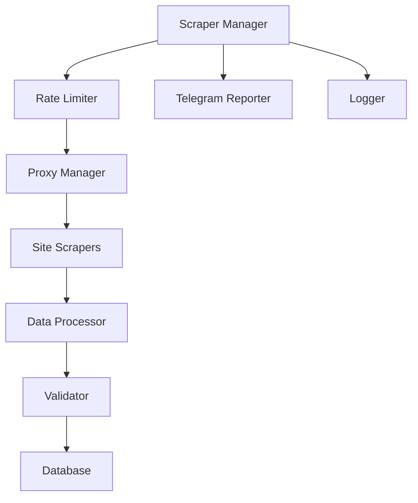

# 🏢 Azerbaijan Real Estate Data Scraper

An enterprise-grade, asynchronous web scraping system for collecting and analyzing real estate listings from major Azerbaijani property websites. Built with modern Python async capabilities and designed for reliability, scalability, and maintainability.

[](https://choosealicense.com/licenses/mit/)
[](https://www.python.org/downloads/)
[](https://github.com/psf/black)
[](https://github.com/Ismat-Samadov/real_estate/graphs/commit-activity)

## 📋 Table of Contents

- [Overview](#-overview)
- [Features](#-features)
- [System Architecture](#-system-architecture)
- [Supported Websites](#-supported-websites)
- [Installation](#-installation)
- [Configuration](#-configuration)
- [Usage](#-usage)
- [Deployment](#-deployment)
- [Monitoring](#-monitoring)
- [Contributing](#-contributing)
- [License](#-license)

## 🎯 Overview

This system autonomously collects comprehensive real estate data from Azerbaijan's leading property websites, providing a unified dataset for analysis and insights. The scraper handles various property types, including:

- 🏢 Apartments and Flats
- 🏘️ Houses and Villas
- 🏬 Commercial Properties
- 🏗️ New Developments
- 🏡 Rental Properties

### Collected Data Points

| Category | Data Points |
|----------|------------|
| Basic Info | Price, Rooms, Floor, Area, Property Type |
| Location | Address, District, Metro Station, GPS Coordinates |
| Features | Renovation Status, Amenities, Building Type |
| Media | Photos, Descriptions, Virtual Tours |
| Contact | Phone Numbers, Agent/Owner Status |
| Metadata | Listing Date, View Count, Update History |

## 🚀 Features

### Core Capabilities

- **High Performance**
  - Asynchronous multi-site scraping
  - Connection pooling
  - Efficient resource utilization
  - Smart rate limiting

- **Reliability**
  - Automatic retry mechanisms
  - Error recovery
  - Data validation
  - Transaction management

- **Monitoring**
  - Real-time Telegram notifications
  - Detailed logging
  - Performance metrics
  - Error tracking

### Technical Features

- **Data Collection**
  - Proxy rotation system
  - Anti-bot detection measures
  - Session management
  - Concurrent processing

- **Data Processing**
  - Advanced text extraction
  - Image URL processing
  - Location normalization
  - Price standardization

- **Storage**
  - MySQL optimization
  - Data deduplication
  - Schema validation
  - Backup system

## 🏗 System Architecture



## 🌐 Supported Websites

| Website | Status | Features | Update Frequency |
|---------|--------|-----------|-----------------|
| [bina.az](https://bina.az) | ✅ | Full data, Photos, Contact | 2h |
| [yeniemlak.az](https://yeniemlak.az) | ✅ | Full data, Location | 2h |
| [emlak.az](https://emlak.az) | ✅ | Full data, Contact | 2h |
| [lalafo.az](https://lalafo.az) | ✅ | API integration | 2h |
| [tap.az](https://tap.az) | ✅ | Full data, Photos | 2h |
| [ev10.az](https://ev10.az) | ✅ | Full data | 2h |
| [arenda.az](https://arenda.az) | ✅ | Full data, Location | 2h |
| [ipoteka.az](https://ipoteka.az) | ✅ | Full data, Mortgage | 2h |
| [unvan.az](https://unvan.az) | ✅ | Full data | 2h |
| [vipemlak.az](https://vipemlak.az) | ✅ | Full data | 2h |

## 🛠 Installation

### Prerequisites

- Python 3.10+
- MySQL 8.0+
- Git
- Virtual Environment

### Step-by-Step Setup

1. **Clone Repository**
   ```bash
   git clone https://github.com/Ismat-Samadov/real_estate.git
   cd real_estate
   ```

2. **Create Virtual Environment**
   ```bash
   python -m venv .venv
   
   # Linux/macOS
   source .venv/bin/activate
   
   # Windows
   .venv\Scripts\activate
   ```

3. **Install Dependencies**
   ```bash
   pip install --upgrade pip
   pip install -r requirements.txt
   ```

4. **Database Setup**
   ```bash
   mysql -u your_user -p your_database < schema.sql
   ```

## ⚙️ Configuration

Create a `.env` file in the project root:

```env
# Database Configuration
DB_NAME=your_database
DB_HOST=your_host
DB_USER=your_user
DB_PASSWORD=your_password
DB_PORT=3306

# Scraper Settings
REQUEST_DELAY=1
MAX_RETRIES=5
LOGGING_LEVEL=INFO
SCRAPER_PAGES=2

# Proxy Configuration
BRIGHT_DATA_USERNAME=your_username
BRIGHT_DATA_PASSWORD=your_password

# Server Settings
SERVER_USER=your_server_user
SERVER_IP=your_server_ip
SUDO_PASSWORD=your_sudo_password

# Telegram Integration
TELEGRAM_BOT_TOKEN=your_bot_token
TELEGRAM_CHAT_ID=your_chat_id
```

## 📊 Monitoring

### Telegram Reports

The system sends detailed reports via Telegram:

```
📊 Scraping Report 2024-01-29 15:30
===================================

🌐 bina.az:
• Scraped: 150
• New: 45
• Updated: 105

🌐 tap.az:
• Scraped: 120
• New: 35
• Updated: 85

[Additional sites...]

📈 Performance Metrics:
• Duration: 180s
• Avg Time/Listing: 0.4s
• Success Rate: 98.5%
```

### Logging

Comprehensive logging is available in `logs/scraper.log`:

```
2024-01-29 15:30:01 INFO Starting scraper application
2024-01-29 15:30:02 INFO Database connection established
2024-01-29 15:30:03 INFO Starting bina.az scraper
[...]
```

## 🚀 Deployment & Scheduling

### Production Deployment

1. **Server Setup**
   ```bash
   # Create application directory
   sudo mkdir -p /var/www/scraper
   sudo chown -R $USER:$USER /var/www/scraper
   
   # Set proper permissions
   sudo chmod 755 /var/www/scraper
   ```

2. **Environment Configuration**
   ```bash
   # Create and secure environment file
   sudo touch /var/www/scraper/.env
   sudo chmod 600 /var/www/scraper/.env
   
   # Set runtime variables
   echo "PYTHONPATH=/var/www/scraper" | sudo tee -a /etc/environment
   echo "SCRAPER_ENV=production" | sudo tee -a /etc/environment
   ```

3. **Service Configuration**
   ```bash
   # Create systemd service
   sudo nano /etc/systemd/system/real-estate-scraper.service
   
   [Unit]
   Description=Real Estate Scraper Service
   After=network.target
   
   [Service]
   Type=oneshot
   User=scraper
   WorkingDirectory=/var/www/scraper
   Environment=PYTHONPATH=/var/www/scraper
   ExecStart=/var/www/scraper/run_scraper.sh
   
   [Install]
   WantedBy=multi-user.target
   ```

### Advanced Scheduling

1. **Primary Scraper Schedule**
   ```bash
   # Deploy optimized crontab configuration
   cat << 'EOF' | sudo tee /etc/cron.d/real-estate-scraper
   SHELL=/bin/bash
   PATH=/usr/local/sbin:/usr/local/bin:/usr/sbin:/usr/bin:/sbin:/bin
   PYTHONPATH=/var/www/scraper
   
   # Main scraping schedule (peak hours)
   0 5,7,9,11,13,15,17,19 * * * scraper /var/www/scraper/run_scraper.sh >> /var/www/scraper/logs/cron.log 2>&1
   
   # Database maintenance (nightly)
   0 1 * * * scraper /var/www/scraper/scripts/db_maintenance.sh >> /var/www/scraper/logs/maintenance.log 2>&1
   
   # Log rotation (weekly)
   0 0 * * 0 scraper /usr/sbin/logrotate /etc/logrotate.d/scraper-logs
   EOF
   
   sudo chmod 644 /etc/cron.d/real-estate-scraper
   ```

2. **Log Rotation Configuration**
   ```bash
   # Configure logrotate
   cat << 'EOF' | sudo tee /etc/logrotate.d/scraper-logs
   /var/www/scraper/logs/*.log {
       weekly
       rotate 4
       compress
       delaycompress
       missingok
       notifempty
       create 0640 scraper scraper
   }
   EOF
   ```

3. **Monitoring Script**
   ```bash
   #!/bin/bash
   # monitor_scraper.sh
   
   # Check if scraper is running
   if ! pgrep -f "python main.py" > /dev/null; then
       echo "Scraper not running. Restarting..."
       systemctl start real-estate-scraper
   fi
   
   # Check log for errors
   if grep -i "error" /var/www/scraper/logs/scraper.log | tail -n 10; then
       curl -s -X POST "https://api.telegram.org/bot${TELEGRAM_BOT_TOKEN}/sendMessage" \
           -d "chat_id=${TELEGRAM_CHAT_ID}" \
           -d "text=⚠️ Scraper errors detected! Check logs."
   fi
   ```

### Process Management

1. **Resource Limits**
   ```bash
   # Set process limits
   cat << 'EOF' | sudo tee /etc/security/limits.d/scraper.conf
   scraper          soft    nofile          65535
   scraper          hard    nofile          65535
   scraper          soft    nproc           4096
   scraper          hard    nproc           4096
   EOF
   ```

2. **Process Control**
   ```bash
   # Systemd process management
   sudo systemctl enable real-estate-scraper
   sudo systemctl start real-estate-scraper
   
   # Monitor service status
   sudo journalctl -u real-estate-scraper -f
   ```

### CI/CD Pipeline

```yaml
name: Deploy Real Estate Scraper

on:
  push:
    branches: [ main ]
  workflow_dispatch:
  schedule:
    - cron: '0 0 * * *'  # Daily deployment check

jobs:
  deploy:
    runs-on: ubuntu-latest
    
    steps:
      - name: Checkout code
        uses: actions/checkout@v4
        
      - name: Setup Python
        uses: actions/setup-python@v4
        with:
          python-version: '3.10'
          
      - name: Install dependencies
        run: |
          python -m pip install --upgrade pip
          pip install -r requirements.txt
          
      - name: Run tests
        run: |
          python -m pytest tests/
          
      - name: Deploy to production
        if: github.ref == 'refs/heads/main'
        env:
          SSH_PRIVATE_KEY: ${{ secrets.SSH_PRIVATE_KEY }}
          DEPLOY_HOST: ${{ secrets.DEPLOY_HOST }}
        run: |
          bash scripts/deploy.sh
          
      - name: Notify deployment status
        if: always()
        run: |
          curl -s -X POST "https://api.telegram.org/bot${TELEGRAM_BOT_TOKEN}/sendMessage" \
              -d "chat_id=${TELEGRAM_CHAT_ID}" \
              -d "text=🚀 Deployment ${{ job.status }}"
```

### Monitoring & Recovery

1. **Health Checks**
   ```bash
   #!/bin/bash
   # health_check.sh
   
   # Check system resources
   MEMORY_USAGE=$(free -m | awk 'NR==2{printf "%.2f%%", $3*100/$2}')
   DISK_USAGE=$(df -h | awk '$NF=="/"{printf "%s", $5}')
   CPU_USAGE=$(top -bn1 | grep "Cpu(s)" | awk '{print $2}')
   
   # Check database connectivity
   mysql -h "$DB_HOST" -u "$DB_USER" -p"$DB_PASSWORD" -e "SELECT 1;" > /dev/null 2>&1
   DB_STATUS=$?
   
   # Report status
   if [ $DB_STATUS -ne 0 ] || [ ${MEMORY_USAGE%.*} -gt 90 ] || [ ${DISK_USAGE%.*} -gt 90 ]; then
       curl -s -X POST "https://api.telegram.org/bot${TELEGRAM_BOT_TOKEN}/sendMessage" \
           -d "chat_id=${TELEGRAM_CHAT_ID}" \
           -d "text=🔴 System alerts:
           Memory: $MEMORY_USAGE
           Disk: $DISK_USAGE
           CPU: $CPU_USAGE%
           Database: $([ $DB_STATUS -eq 0 ] && echo '✅' || echo '❌')"
   fi
   ```

2. **Auto-Recovery**
   ```bash
   # Deploy supervisor configuration
   cat << 'EOF' | sudo tee /etc/supervisor/conf.d/scraper.conf
   [program:real-estate-scraper]
   command=/var/www/scraper/run_scraper.sh
   user=scraper
   directory=/var/www/scraper
   autostart=true
   autorestart=true
   startretries=3
   stderr_logfile=/var/www/scraper/logs/supervisor.err.log
   stdout_logfile=/var/www/scraper/logs/supervisor.out.log
   environment=PYTHONPATH="/var/www/scraper",SCRAPER_ENV="production"
   EOF
   ```

## 👥 Contributing

Contributions are welcome! Please read our [Contributing Guidelines](CONTRIBUTING.md) for details on our code of conduct and the process for submitting pull requests.

## 📄 License

This project is licensed under the MIT License - see the [LICENSE](LICENSE) file for details.

## 🙋‍♂️ Author

**Ismat Samadov**
- GitHub: [@Ismat-Samadov](https://github.com/Ismat-Samadov)
- Email: [ismetsemedov@gmail.com](mailto:ismetsemedov@gmail.com)

## 🛠️ Tech Stack

- [Python](https://www.python.org/) - Core language
- [aiohttp](https://docs.aiohttp.org/) - Async HTTP client/server
- [BeautifulSoup4](https://www.crummy.com/software/BeautifulSoup/) - HTML parsing
- [MySQL Connector](https://dev.mysql.com/doc/connector-python/en/) - Database operations
- [python-telegram-bot](https://python-telegram-bot.org/) - Telegram integration
- [GitHub Actions](https://github.com/features/actions) - CI/CD pipeline