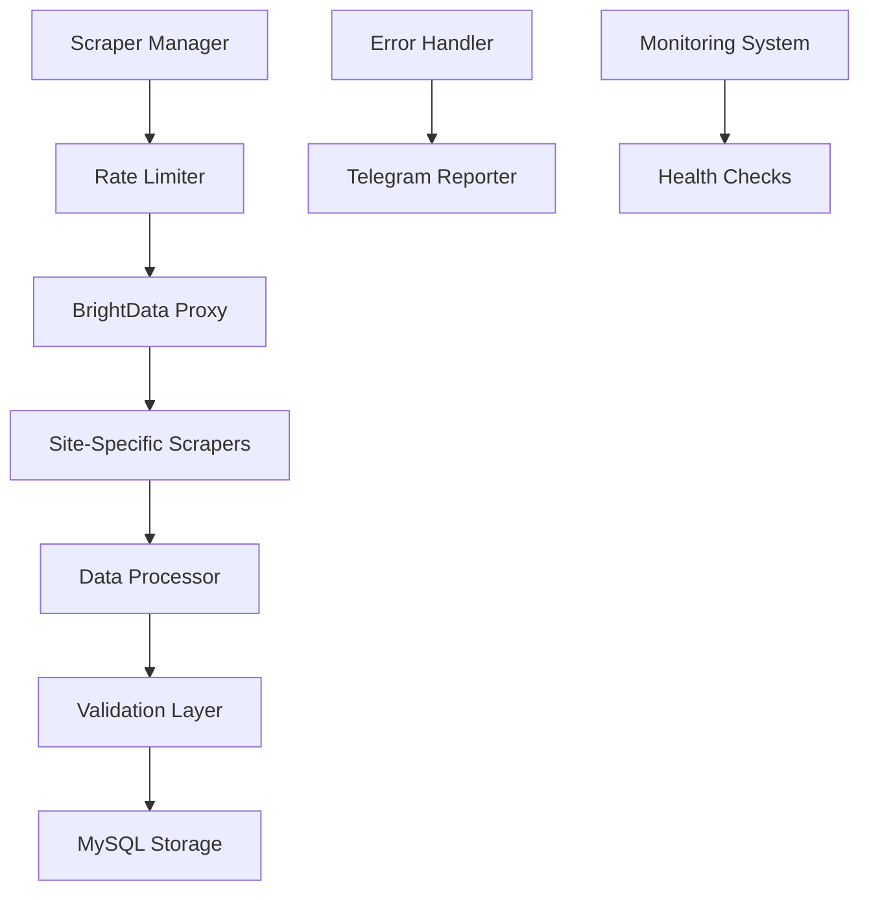

# 🏢 Enterprise Real Estate Data Collection System

A high-performance, distributed web scraping infrastructure designed for collecting and processing real estate data from Azerbaijan's property market. Built with advanced asynchronous architecture, sophisticated proxy management, and enterprise-grade error handling.

[](https://choosealicense.com/licenses/mit/)
[](https://www.python.org/downloads/)
[](https://docs.aiohttp.org/)
[](https://www.mysql.com/)

## System Architecture

### Data Flow Overview



### Core Components

1. **Proxy Management System**
   - BrightData integration with country-specific routing
   - Automatic session management and rotation
   - Connection pooling and retry logic
   - Anti-detection mechanisms

2. **Distributed Scraping Infrastructure**
   - Asynchronous execution with aiohttp
   - Site-specific rate limiting
   - Connection pooling
   - Concurrent request optimization

3. **Error Recovery System**
   - Multi-level retry mechanisms
   - Exponential backoff
   - Session recovery
   - State preservation

## Technical Details

### Scraper Implementation

Each scraper implements sophisticated data extraction:

```python
class BaseScraper:
    async def init_session(self):
        """Initialize aiohttp session with advanced configuration"""
        if not self.session:
            headers = {
                'User-Agent': 'Mozilla/5.0...',
                'Accept': 'text/html,application/xhtml+xml...',
                'Accept-Language': 'az,en-US;q=0.9,en;q=0.8',
                'Accept-Encoding': 'gzip, deflate, br',
                'Connection': 'keep-alive',
                'Cache-Control': 'max-age=0'
            }
            
            self.session = aiohttp.ClientSession(
                headers=headers,
                timeout=aiohttp.ClientTimeout(total=30),
                connector=aiohttp.TCPConnector(
                    ssl=False,
                    limit=10,
                    ttl_dns_cache=300
                )
            )
```

### Proxy Integration

Advanced proxy management with retry logic:

```python
class BrightDataProxy:
    def __init__(self):
        self.proxy_host = 'brd.superproxy.io:22225'
        self.username = f"{os.getenv('BRIGHT_DATA_USERNAME')}-country-az"
        self.proxy_url = f"http://{self.username}:{self.password}@{self.proxy_host}"
        
    async def verify_proxy(self):
        """Verify proxy connection with enhanced error handling"""
        try:
            session = await self.create_session()
            async with session:
                async with session.get(
                    'https://geo.brdtest.com/mygeo.json',
                    proxy=self.proxy_url,
                    timeout=30,
                    verify_ssl=False
                ) as response:
                    # Verification logic
```

### Database Schema

Optimized MySQL schema with proper indexing:

```sql
CREATE TABLE properties (
    id BIGINT PRIMARY KEY AUTO_INCREMENT,
    listing_id VARCHAR(50),
    source_website VARCHAR(100),
    UNIQUE KEY unique_listing (listing_id, source_website),
    
    -- Location data
    latitude VARCHAR(100),
    longitude VARCHAR(100),
    district VARCHAR(100),
    metro_station VARCHAR(100),
    
    -- Property details
    property_type VARCHAR(50),
    listing_type ENUM('daily', 'monthly', 'sale'),
    price DECIMAL(12, 2),
    
    -- Indices for optimization
    INDEX idx_location (district, metro_station),
    INDEX idx_property (property_type, listing_type),
    INDEX idx_price (price)
) ENGINE=InnoDB DEFAULT CHARSET=utf8mb4 COLLATE=utf8mb4_unicode_ci;
```

## System Components

### 1. Site-Specific Scrapers

Each website has a dedicated scraper with customized parsing:

| Scraper | Features | Complexity |
|---------|----------|------------|
| BinaScraper | Full HTML parsing, Anti-bot, Location extraction | High |
| LalafoScraper | API integration, JSON processing | Medium |
| TapAzScraper | Dynamic content, Phone number API | High |
| EmlakScraper | Advanced pagination, Proxy rotation | Medium |

### 2. Data Processing Pipeline

```python
async def process_listing(self, html: str, listing_id: str) -> Dict:
    """Process listing with advanced validation"""
    try:
        # Extract base data
        data = await self.extract_base_data(html)
        
        # Process specific fields
        coordinates = self.extract_coordinates(html)
        contact_info = await self.get_phone_numbers(listing_id)
        
        # Validate and clean data
        return self.validate_listing_data({
            **data,
            **coordinates,
            **contact_info
        })
    except Exception as e:
        self.logger.error(f"Processing error: {str(e)}")
        raise
```

### 3. Error Handling System

Comprehensive error recovery:

```python
class ErrorHandler:
    async def handle_request_error(self, url: str, attempt: int, error: Exception):
        """Handle request errors with exponential backoff"""
        if isinstance(error, aiohttp.ClientError):
            await self.handle_client_error(error)
        elif isinstance(error, asyncio.TimeoutError):
            await self.handle_timeout(url, attempt)
        else:
            await self.handle_general_error(error)
            
        # Calculate backoff
        delay = min(300, (2 ** attempt) + random.uniform(0, 1))
        await asyncio.sleep(delay)
```

## Monitoring & Reporting

### 1. Telegram Integration

Real-time monitoring and alerts:

```python
class TelegramReporter:
    async def send_report(self, scraper_stats: Dict, db_stats: Dict):
        """Send comprehensive performance report"""
        report = self.generate_report_header()
        report += self.format_scraper_stats(scraper_stats)
        report += self.format_database_stats(db_stats)
        report += self.generate_performance_metrics()
        
        await self.bot.send_message(
            chat_id=self.chat_id,
            text=report,
            parse_mode='HTML'
        )
```

### 2. Health Checks

System health monitoring:

```bash
#!/bin/bash
# health_checker.sh

# System metrics
monitor_system() {
    memory=$(free -m | awk 'NR==2{printf "%.2f%%", $3*100/$2}')
    disk=$(df -h | awk '$NF=="/"{printf "%s", $5}')
    load=$(uptime | awk -F'load average:' '{ print $2 }')
    
    # Alert if thresholds exceeded
    [ "${memory%.*}" -gt 90 ] && alert "Memory usage critical: $memory"
    [ "${disk%.*}" -gt 90 ] && alert "Disk usage critical: $disk"
}

# Database health
check_database() {
    mysql -h "$DB_HOST" -u "$DB_USER" -p"$DB_PASSWORD" \
        -e "SELECT COUNT(*) FROM properties" > /dev/null 2>&1 || \
        alert "Database connection failed"
}

# Process monitoring
check_processes() {
    pgrep -f "python main.py" > /dev/null || restart_scraper
}
```

## Deployment

### Production Setup

1. **System Configuration**
   ```bash
   # Create service user
   sudo useradd -r -s /bin/false scraper
   
   # Set up application directory
   sudo mkdir -p /var/www/scraper/{logs,data}
   sudo chown -R scraper:scraper /var/www/scraper
   sudo chmod 750 /var/www/scraper
   ```

2. **Environment Configuration**
   ```bash
   # Deploy environment file
   sudo -u scraper cat > /var/www/scraper/.env << EOF
   DB_NAME=${DB_NAME}
   DB_HOST=${DB_HOST}
   DB_USER=${DB_USER}
   DB_PASSWORD=${DB_PASSWORD}
   DB_PORT=3306
   
   REQUEST_DELAY=1
   MAX_RETRIES=5
   LOGGING_LEVEL=INFO
   
   BRIGHT_DATA_USERNAME=${BRIGHT_DATA_USERNAME}
   BRIGHT_DATA_PASSWORD=${BRIGHT_DATA_PASSWORD}
   
   TELEGRAM_BOT_TOKEN=${TELEGRAM_BOT_TOKEN}
   TELEGRAM_CHAT_ID=${TELEGRAM_CHAT_ID}
   EOF
   
   sudo chmod 600 /var/www/scraper/.env
   ```

3. **Process Management**
   ```bash
   # Deploy systemd service
   sudo cat > /etc/systemd/system/real-estate-scraper.service << EOF
   [Unit]
   Description=Real Estate Data Collection Service
   After=network.target mysql.service
   
   [Service]
   Type=simple
   User=scraper
   Group=scraper
   WorkingDirectory=/var/www/scraper
   Environment=PYTHONPATH=/var/www/scraper
   Environment=SCRAPER_ENV=production
   ExecStart=/var/www/scraper/run_scraper.sh
   Restart=always
   RestartSec=10
   
   # Security
   NoNewPrivileges=yes
   PrivateTmp=yes
   ProtectSystem=full
   ProtectHome=yes
   
   # Resource limits
   LimitNOFILE=65535
   LimitNPROC=4096
   
   [Install]
   WantedBy=multi-user.target
   EOF
   
   sudo systemctl daemon-reload
   sudo systemctl enable real-estate-scraper
   ```

4. **Advanced Scheduling**
   ```bash
   # Deploy crontab configuration
   sudo cat > /etc/cron.d/real-estate-scraper << EOF
   SHELL=/bin/bash
   PATH=/usr/local/sbin:/usr/local/bin:/usr/sbin:/usr/bin:/sbin:/bin
   PYTHONPATH=/var/www/scraper
   
    # Every 2 minutes from 8 AM to 7 PM
    */2 8-18 * * * scraper /var/www/scraper/run_scraper.sh > /dev/null 2>&1

    # Every 5 minutes from 7 PM to midnight
    */5 19-23 * * * scraper /var/www/scraper/run_scraper.sh > /dev/null 2>&1

    # Every 5 minutes from midnight to 1 AM
    */5 0 * * * scraper /var/www/scraper/run_scraper.sh > /dev/null 2>&1

    # Every 30 minutes from 1 AM to 8 AM
    */30 1-7 * * * scraper /var/www/scraper/run_scraper.sh > /dev/null 2>&1
   # Health checks (every 5 minutes)
   */5 * * * * scraper /var/www/scraper/scripts/health_check.sh > /dev/null 2>&1
   EOF
   ```

## Performance Optimization

### 1. Database Optimization

```sql
-- Optimize tables weekly
OPTIMIZE TABLE properties;

-- Update statistics
ANALYZE TABLE properties;

-- Clean old records
DELETE FROM properties 
WHERE updated_at < DATE_SUB(NOW(), INTERVAL 30 DAY);

-- Maintain indices
ALTER TABLE properties FORCE;
```

### 2. Resource Management

```bash
# Set process limits
cat > /etc/security/limits.d/scraper.conf << EOF
scraper          soft    nofile          65535
scraper          hard    nofile          65535
scraper          soft    nproc           4096
scraper          hard    nproc           4096
scraper          soft    as              unlimited
scraper          hard    as              unlimited
EOF
```

### 3. Connection Pooling

```python
# Configure aiohttp connection pooling
connector = aiohttp.TCPConnector(
    limit=10,              # Max connections
    limit_per_host=2,      # Max per host
    enable_cleanup_closed=True,
    force_close=True,
    verify_ssl=False,
    ttl_dns_cache=300,
    use_dns_cache=True
)
```

## Contributing

Please read [CONTRIBUTING.md](CONTRIBUTING.md) for details on our code of conduct and the process for submitting pull requests.

## License

This project is licensed under the MIT License - see the [LICENSE](LICENSE) file for details.

## Author

**Ismat Samadov**
- GitHub: [@Ismat-Samadov](https://github.com/Ismat-Samadov)
- Email: [ismetsemedov@gmail.com](mailto:ismetsemedov@gmail.com)